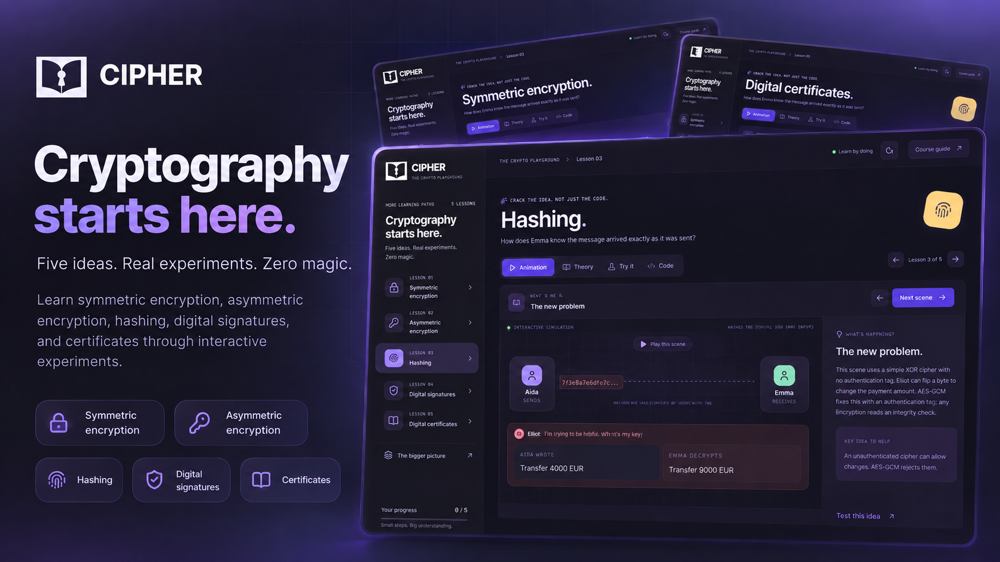

# LearnCryptography



A practical learning website that helps students understand cryptography through visual lessons and hands-on experiments. The goal is to make encryption, hashing, signatures, and digital certificates easier to understand and use.

## Install and run

Requires Node.js 24 or newer and npm.

```sh
git clone https://github.com/recepbalibey/LearnCryptography.git
cd LearnCryptography
npm ci
npm run dev -- --host 127.0.0.1 --port 5187
```

Open [localhost:5187](http://127.0.0.1:5187/) in your browser.
